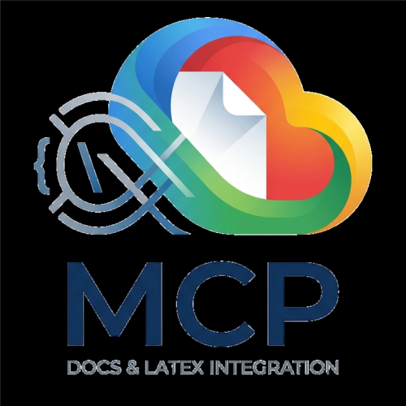

<div align="center">
  

  # MCP TCC — Google Docs ↔ LaTeX Bridge

  <p>
    
    
    
  </p>

  <p><b>Automatize a ponte entre a escrita criativa no Google Docs e a compilação acadêmica em LaTeX, usando Inteligência Artificial.</b></p>
</div>

<br>

O **TCC DocsLaTeX Bridge** é um servidor [Model Context Protocol (MCP)](https://modelcontextprotocol.io/) desenhado especificamente para ajudar na criação de teses, dissertações e TCCs. Ele fornece a agentes de IA — como o **Claude Desktop** ou o **Cursor IDE** — o poder de ler, estruturar, comentar e modificar seus documentos do Google Docs de forma atômica e segura, bem como salvar as versões finais no seu repositório local em `.tex`. 

Tudo isso encapsulado em um **único executável**, eliminando a necessidade de preparar complexos ambientes em Python ou Node.js.

---

## ✨ Arsenal de Ferramentas Disponíveis

Diferente de versões anteriores, o servidor hoje conta com um portfólio robusto de **10 ferramentas avançadas** para maximizar o fluxo de edição da IA:

### 📖 Descoberta e Leitura

- **`list_available_documents`**: Lista todos os documentos Google Docs que estão acessíveis pela Service Account configurada. Retorna o título, ID e link de cada documento. Use esta ferramenta para descobrir quais documentos o robô pode acessar antes de tentar ler ou modificar um documento específico. Se a variável `ALLOWED_DOC_IDS` estiver configurada, apenas os documentos da lista serão exibidos.
- **`get_doc_skeleton`**: Retorna a estrutura hierárquica e lógica de tópicos, capítulos e parágrafos marcados como cabeçalhos ou destaques do documento, contendo seus índices absolutos de caracteres (`start_index` e `end_index`). Essencial para planejar leituras parciais de documentos acadêmicos extensos antes de ler o texto completo.
- **`read_doc_content`**: Lê o texto do Google Doc e o retorna estruturado em formato Markdown. Aceita parâmetros opcionais de início (`start_index`) e fim (`end_index`) para ler fatias específicas do documento, reduzindo o consumo de tokens em arquivos grandes.
- **`search_in_doc`**: Pesquisa um termo no Google Doc e retorna os índices inicial e final de todas as ocorrências encontradas junto a um snippet de contexto. Se o parâmetro `is_regex` for verdadeiro, processa a consulta como uma Expressão Regular para buscas complexas ou de padrões de formatação (ABNT).

### 💬 Interação Acadêmica (Comentários)

- **`list_doc_comments`**: Lista todos os comentários de um arquivo no Google Drive, incluindo o trecho de texto original ao qual cada comentário está ancorado. Ideal para capturar correções e sugestões do orientador. Aceita tanto o ID puro do documento quanto a URL completa do Google Docs. O ID do Google Docs é o mesmo usado no Google Drive.
- **`reply_to_comment`**: Adiciona uma resposta a um comentário existente no Google Docs via Drive API.
- **`resolve_comment`**: Marca um comentário como resolvido no Google Docs via Drive API.

### ✏️ Escrita e Sincronização

- **`replace_text_in_doc`**: Realiza a substituição de termos de texto no documento. Permite informar o parâmetro `occurrence_index` para alterar uma ocorrência específica (ex: 0 para a primeira ocorrência, 1 para a segunda). Se definido como -1 ou omitido, realiza a substituição de todas as correspondências encontradas.
- **`multi_replace_doc_block`**: Aplica em lote substituições cirúrgicas de texto em índices absolutos de caracteres. Requer validação exata do texto esperado (`expected_text`) em cada intervalo informado. Executa as alterações de trás para frente no documento para neutralizar o deslocamento de índices (*offset shift*) durante a operação.
- **`update_local_latex`**: Reescreve o conteúdo de um arquivo `.tex` local no disco. Cria automaticamente um backup (`.bak`) do original antes de sobrescrever. Por segurança, aceita APENAS arquivos com extensão `.tex`. Parâmetros: - `filepath`: Caminho absoluto do arquivo `.tex` (ex: `C:/Users/.../main.tex`) - `new_content`: O conteúdo LaTeX completo que será escrito no arquivo.

> **💡 Dica de Ouro:** As ferramentas que exigem o documento aceitam tranquilamente a **URL completa do seu Docs** ou apenas o **ID**. A IA e o servidor lidam com a extração!

---

## 🚀 Como Usar (Em 3 Passos)

### Passo 1: Obter o Executável
Acesse a aba [**Releases**](https://github.com/JGustavoCN/mcp-gdocs-latex/releases) e faça o download da versão compatível com a sua máquina:
* 🪟 Windows: `mcp-tcc.exe`
* 🐧 Linux: `mcp-tcc-linux`
* 🍎 macOS: `mcp-tcc-darwin`

### Passo 2: Credenciais do Google (`credentials.json`)
Baixe a sua chave de autenticação (Service Account) e a coloque **na mesma pasta** que o executável recém-baixado, nomeando-a como `credentials.json`.

<details>
<summary><b>Precisa de ajuda para gerar o credentials.json? (Clique para expandir)</b></summary>

1. Acesse o [Google Cloud Console](https://console.cloud.google.com/).
2. Crie ou selecione um projeto.
3. Ative as APIs: **Google Docs API** e **Google Drive API**.
4. Acesse: **IAM e Admin** → **Contas de serviço** → **Criar conta de serviço**.
5. Gere e baixe a chave tipo **JSON**. Renomeie-a para `credentials.json`.
6. **Importante:** Vá no seu TCC (no Google Docs), clique em "Compartilhar", e convide o e-mail dessa nova Service Account como **Editor**.
</details>

```text
📁 Meu Workspace/
├── mcp-tcc.exe          ← Seu executável recém-baixado
└── credentials.json     ← Sua chave de autenticação
```

### Passo 3: Conectar a IA (Claude ou Cursor)

Abra o arquivo de configuração de servidores MCP da sua ferramenta predileta e adicione o servidor do TCC:

**Para o Claude Desktop** (`claude_desktop_config.json`):
```json
{
  "mcpServers": {
    "tcc-docs-latex": {
      "command": "C:\\caminho\\absoluto\\para\\mcp-tcc.exe"
    }
  }
}
```

**Para o Cursor IDE** (`.cursor/mcp.json`):
```json
{
  "mcpServers": {
    "tcc-docs-latex": {
      "command": "C:\\caminho\\absoluto\\para\\mcp-tcc.exe"
    }
  }
}
```
**Pronto! 🎉** Sua IA agora se comunica com os servidores do Google Docs!

---

## 🔒 Segurança e Restrições (Variáveis de Ambiente)

A segurança do seu trabalho é vital. Por padrão, a IA acessa qualquer Docs compartilhado com a Service Account. Você pode (e deve) restringir esse escopo:

| Variável | Efeito |
|---|---|
| `ALLOWED_DOC_IDS` | Lista as URLs ou IDs (separados por vírgula) permitidos de serem lidos ou editados. Se a IA tentar acessar fora da lista, o servidor bloqueia no mesmo instante. |
| `GOOGLE_APPLICATION_CREDENTIALS` | Usada se você preferir hospedar o `credentials.json` numa pasta separada do executável. |

---

## 🛠️ Para Desenvolvedores (Construindo o Projeto)

Se deseja estender o comportamento do servidor ou inspecionar a robusta implementação de cálculo de limites UTF-16, a compilação local é super fácil. Requer [Go 1.25+](https://go.dev/dl/).

```bash
# Clone e entre no repositório
git clone https://github.com/JGustavoCN/mcp-gdocs-latex.git
cd mcp-gdocs-latex

# Sincronize módulos
go mod tidy

# O Makefile facilita os builds:
make build           # Build para seu SO atual
make build-windows   # Cross-compile para Windows (bin/mcp-tcc.exe)
make build-linux     # Cross-compile para Linux (bin/mcp-tcc-linux)
make build-mac       # Cross-compile para macOS (bin/mcp-tcc-darwin)
```

### Estrutura do Código:
```text
├── cmd/mcp-server/main.go      → Entrypoint central do protocolo stdio
├── internal/
│   ├── gdocs/                  → Submódulo de interação via Docs e Drive APIs
│   │   ├── auth.go             → Thread-safe Singletons para autenticação (Service Account)
│   │   ├── reader.go           → Leitura segmentada, paginação e parse Markdown estrutural
│   │   ├── writer.go           → Escrita no Google Doc (batchUpdate com Offset Shift Protection)
│   │   ├── comments.go         → Busca, resposta e resolução de comentários
│   │   ├── validator.go        → Extração autônoma de IDs (Regex) e bloqueio de Allowlist
│   │   └── listing.go          → Varredura via Drive API das permissões ativas
│   ├── mcp/
│   │   └── tools.go            → Registry das 10 ferramentas no Server do SDK
│   └── latex/
│       └── local_file.go       → Gravação e fallback dinâmico (Backup .bak) em disco local
└── Makefile                    → Recipes para build otimizado
```

---

## ❓ FAQ (Perguntas Frequentes)

**P: Eu preciso instalar o Go (Golang) para que a IA funcione?**
R: **De jeito nenhum!** Baixe o executável pronto das Releases. O Go é apenas para desenvolvedores de software que desejam recompilar a fonte.

**P: Minhas chaves e dados do Google Docs estão seguros?**
R: Sim! O código fonte é público. Toda comunicação é feita unicamente entre o executável rodando na _sua_ máquina e a infraestrutura oficial do Google APIs (utilizando a _sua_ conta de serviço). 

**P: A IA vai sobrescrever meu arquivo local `.tex` e jogar fora o conteúdo antigo?**
R: Toda vez que a ferramenta `update_local_latex` for invocada, o servidor MCP fará proativamente uma cópia em backup (ex: `main.tex.bak`) com o conteúdo antigo, antes de introduzir as novas formatações.

---

<div align="center">
  <i>Feito com ❤️ para reduzir o sofrimento de quem escreve TCC.</i><br>
  <b>Licença MIT</b> — Use, modifique e distribua à vontade.
</div>
